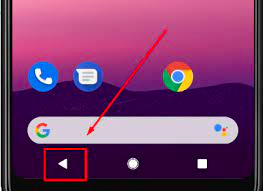

# Insight about [Application.Quit](https://docs.unity3d.com/ScriptReference/Application.Quit.html)
In android devices  there is back button that from UX guidline for games leads to present a popup to players
with offering to close the game or back to play. 



Depending on the user’s Android device, this button might be a physical button or a software button [Link](https://developer.android.com/guide/navigation/navigation-custom-back).
On some devices you have to go System Settings and enable this functionaly.
Or you have custom implementation of UI elements to offer quitting the game.

Usually from code you call the Unity api [Application.Quit()](https://docs.unity3d.com/ScriptReference/Application.Quit.html)
If you avoid using this api it can decrease ANR ratio;

**Why avoid calling Application.Quit?**

Closing an application is a resource-intensive task for an operating system as it involves disposing of resources and terminating any ongoing activities of the application. If any activity overrides the onDestroy method and adds custom logic, it can further complicate the process. This cascading effect can potentially cause an "Application Not Responding" (ANR) error in the system.
From my analysis I discovered a group of ANR with a stacktrace that included onDestroy() of Unity activity.
Do not worry, the system will make decision better when it needs to free up resources of your application in background.


**What is about Unity**

You can implement an alternative method to emulate exit from application for an user on Android device. And for instance it could be calling moveTaskToBack method from UnityActivity.
```
        [Conditional("UNITY_ANDROID")]
        public void MoveApplicationToBack()
        {
            try
            {
                var activity = new AndroidJavaClass("com.unity3d.player.UnityPlayer").GetStatic<AndroidJavaObject>("currentActivity");
                activity.Call<bool>("moveTaskToBack", true);
            }
            catch (Exception e)
            {
                Debug.LogException(e);
                Application.Quit();
            }
        }
```

How to get callback when player press back button. The simplest way
```
void Update ()
{
    if (Input.GetKeyDown(KeyCode.Escape)
    {
        //pressed back button
    }
}
```

**A general advice**
It's recommended that you review the custom logic of your app within the [OnApplicationQuit](https://docs.unity3d.com/ScriptReference/MonoBehaviour.OnApplicationQuit.html) callback, particularly for mobile target platforms. 
- This callback may not be a reliable way to save player data or send analytics on mobile devices, so it's important to consider alternative approaches. 
- Additionally, optimizing the custom logic in your app's lifecycle can reduce performance impact and make it easier for the operating system to destroy the application, potentially reducing ANR.

**More linked info**
[Unity Forum](https://forum.unity.com/threads/what-is-input-dispatching-timed-out-and-how-to-solve-it.833515/page-2)

**Date** 28.04.2023,
**Unity** version 2020 and 2021