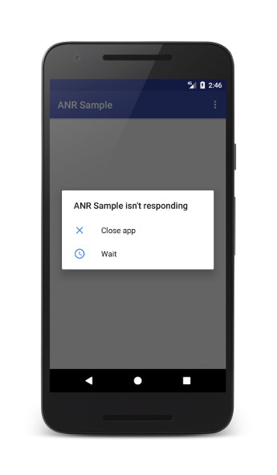

# Introduction
**Briefly explain what ANR (Application Not Responding) and crashes are, and why they're important to manage.**

In mobile user experience player can meet some abnormal application behaviour like unexpected quitting (Crash) or hanging application (ANR - Application Not Responding) . 
Lets see an example of the dialog:
 


>Are you sure a player will restart the application and continue use your application?

Usually the root causes of the bad behavior are technical issues of the application simply said bugs in the code of the application or in operation system.
Crashes happens when OS can not execute not allowed operation from an application and will terminate the application. ANR is specifically android reported issue 
and triggered when UI thread is blocked for too long.

**That is really important to manage high count of ANR and Crashes because:**

- platform markets can decrease discoverability of your application and it will **reduce organic installs**.
- user will leave your application if it freezes or crashed frequently and it can **increase uninstalls** and  **reduce retention** metrics.
- user will score low your app in market and it will decrease installs and make harder to convert your paid impressions to installs. 
- all of these will lead to lower revenue from the application

About less discoverability on Google there is [the notice](https://developer.android.com/topic/performance/vitals/anr).
<em>If your app exceeds the overall bad behavior threshold, it is likely to be less discoverable on all devices. If your app exceeds the per-device bad behavior threshold on some devices, it is likely to be less discoverable on those devices, and a warning may be shown on your store listing._
</em>
About thresholds we talk a bit later.

**State the purpose of the article and provide an overview of what readers can expect to learn.**

I've dedicated a lot of time to tackling technical issues in Unity games and striving to stay below market red thresholds. 
Through my experience, I've gained valuable insights and learned how to create a clear process for managing ANR/Crashes. 
I want to share my knowledge in this article with you and help you navigate these challenges more effectively.

**The content might be usefull for:**
- Unity engineers who have to identify a root cause of ANR/Crash and fix it.
- Non technical people who wants to understand these issues better. And understand reasoning some action items for production.


# Understanding ANR and Crashes
**Explain what ANR and crashes are in more detail.**

Before explaining in details what ANR and Crashes are lets see :

- Platform and type of issue:

|         | Google Android | Apple iOS |
|---------|----------------|-----------|
| ANR     | YES            | NO        |
| Crashes | YES            | YES       |


- Platform official thresholds for daily active users experience:

|         | Google Android                                                                                      | Apple iOS |
|---------|-----------------------------------------------------------------------------------------------------|-----------|
| ANR     | [<0.47% & 8% for single device model](https://developer.android.com/topic/performance/vitals/anr)   | NO        |
| Crashes | [<1.09% & 8% for single device model](https://developer.android.com/topic/performance/vitals/crash) | NO        |

<em> Google recomends to be < 2% for single device model </em>

Please keep in mind Google can update sometimes calculation of the metrics like introducing **user-percieved** metric or update reporting system with new Android OS.
**The user-perceived** issue is an issue that is likely to have been noticied by the user.
[More](https://android-developers.googleblog.com/2022/10/raising-bar-on-technical-quality-on-google-play.html)


**Provide examples of common causes of ANR and crashes, such as long-running operations, unresponsive UI, memory leaks, and exceptions**.

Lets start from ANR:

Android will display the ANR dialog for a particular application when it detects one of the following conditions and **the application in foreground**:

- No response to an input event (e.g. key press, screen touch) within **5 seconds currently**.
- A BroadcastReceiver hasn't finished executing within **5 seconds currently** (before it was 10 seconds).
- UI thread is blocked for more than ~**5 seconds currently**.

<em>And a good news is before these issues in background were reported to Google analytics and can lead less discoverbility of the app. Today it will be reported only in case if user will notice the issue likely.</em>

There are some common patterns of root causes when **ANRs**:

- The app is doing slow IO operations on [the main thread](https://developer.android.com/guide/components/processes-and-threads) .
- The app is doing a CPU long operation on [the main thread](https://developer.android.com/guide/components/processes-and-threads) .
- [The main thread](https://developer.android.com/guide/components/processes-and-threads) is doing a synchronous binder call to another process, and that other process is taking a long time to return.
- [The main thread](https://developer.android.com/guide/components/processes-and-threads) is blocked waiting for a synchronized block for a long operation that is happening on another thread.
- [The main thread](https://developer.android.com/guide/components/processes-and-threads) is in a deadlock with another thread, either in your process or via a binder call. The main thread is not just waiting for a long operation to finish, but is in a deadlock situation.

**Simply said you need to keep your app responsive to avoid ANR**

Please keep in mind that Android main thread is not UI thread always. And Unity main thread is not Android UI thread or Android main thread. 
**Usually Android UI thread is different to Unity main thread.** And you have to synchronize data between these threads when it needs to process callbacks from Java code to Unity.
And next important thing is Unity API is not thread safe and all your game code what you are running in Update or when calling Resource.Load will be executed on Unity main thread and Unity api should be called 
from Unity main thread. 

I'd like to highlight one non-obvious thing about heavy operations doing on Unity main thread. These opertions should not lead to ANR because different threads, but actually it does. 
Because sometimes in Unity life cycle Android main thread and Unity main thread will be synchronized. For instance when resume application.

From my experince the most popular reason to get ANR is that some Java code is doing something on UI thread or blocking inputs. 
If you are using Ads in the game, most likeli the advertisement videos are the top root cause of your ANRs.

**What is about Crash in Unity games?**
The most popular reason is an unhadled exception in unamanaged part of your game. That can come from thirdparty sdk like Iron Source or Firebase for example.
Unity games can crash:

- Memory issues:  if they use too much memory or if there are memory leaks. This can happen if the game has too many objects, textures, or other resources loaded at once.
- Device and OS compatibility issues: like you call not implemented API of OS. 
- GPU problems: Not compatible shader for example , like you forgot about Adreno GPU specifics and tested  your custom shaderon Mali only. [System requirements](https://docs.unity.cn/ru/2021.1/Manual/system-requirements.html)
- Code errors: due to code errors such as null reference exceptions (if you brave enough you can set Fast But Not Exception for iOS), division by zero when use il2Cpp attributes, or infinite loops. 
- Asset problems: if there are problems with assets such as textures (4096 sise is too big for some devices), asset bundles, models, or animations. These problems can include missing or corrupted files, incorrect file paths, or incompatible file formats.
- Poor network connectivity:
- Hardware issues: This can include overheating, battery drain, or other hardware issues that cause instability.

Memory issues: Unity mobile games can crash if they use too much memory or if there are memory leaks. Mobile devices have limited resources compared to desktop computers, so it's important to optimize memory usage in mobile games.
Device compatibility issues: Mobile games can crash if they are not compatible with certain devices or if the device hardware is not up to par. Developers should test their games on a variety of devices to ensure compatibility.
Poor network connectivity: If the mobile game relies on network connectivity and there are issues with the network, the game can crash or become unresponsive. Developers should handle network errors gracefully to prevent crashes.
Battery drain: Mobile games that consume too much battery can cause the device to shut down unexpectedly, which can result in a crash. Developers should optimize their games to minimize battery usage.
Background processing: Mobile games can crash if they continue to run in the background even when the user is not actively playing the game. This can cause memory and performance issues, which can lead to crashes. Developers should ensure that their games properly pause and resume when they enter and exit the foreground.

[How to find a memory leak with Unity memory profiler](https://docs.unity3d.com/Packages/com.unity.memoryprofiler@0.2/manual/workflow-memory-leaks.html#:~:text=Memory%20leaks%20typically%20happen%20because,because%20of%20an%20unintentional%20reference.)

**Discuss the impact of ANR and crashes on user experience and app performance.**
The user might then decide to quit your application and uninstall it if they are unhappy.


In mobile development we can struggle of 2  technical issues : Crashes and ANR. 
**ANR** is specifically Android family devices issue. Some root causes that lead ANR in android are crash on iOS.
[Google said](https://developer.android.com/topic/performance/vitals/anr) that ANR happens <em>'When the UI thread of an Android app is blocked for too long, an "Application Not Responding" (ANR) error is triggered.
If the app is in the foreground, the system displays a dialog to the user. The ANR dialog gives the user the opportunity to force quit the app.'</em>


For iOS I was not able to find from their documentation any thresholds, that is why with taking into account knowledge about iOS platform, stricted model line of devices
and more ARPU in comparing to Android users. I recomend to set at lest 3x lower.


**Lets make some summury: **


# Tools for Identifying ANR and Crashes
* Describe different tools that developers can use to identify ANR and crashes, such as crash reporting libraries, logcat, and Android Profiler.
* Explain how each tool works and what kind of information it provides.
* Provide examples of how to use each tool to diagnose ANR and crashes.

Some of the common crash reporting tools that Android developers use are the following:

Firebase (Free, https://firebase.google.com/)
Crashlytics (Free, http://try.crashlytics.com/)
Apteligent (Freemium, https://www.apteligent.com/)
Bugsnag (Freemium, https://bugsnag.com/)
For a list of third-party tools (free or paid) that you can use to view crash reports for your apps, please see here:

https://appsamurai.com/8-crash-reporting-tools-for-ios-and-android-apps/
https://www.captechconsulting.com/blogs/a-comparison-of-android-crash-reporting-tools

# Preventing ANR and Crashes
* Outline best practices for preventing ANR and crashes, such as optimizing code, avoiding blocking operations, using background threads, and handling exceptions properly.
* Provide examples of how to implement each best practice in code.
* Discuss the importance of testing and how to test for ANR and crashes.

From code perspective you have to move all heavy operations (like network requests,IO, CPU heavy calculation) from UI thread to worker threads and being guided by best practices about threads.


Lets take a look on piece of code from Unity 2021.3 [UnitySynchronizationContext.cs](https://github.com/Unity-Technologies/UnityCsReference/blob/master/Runtime/Export/Scripting/UnitySynchronizationContext.cs)
```
// All requests must be processed on the main thread where the full Unity API is available
        private void Exec()
        {
            lock (m_AsyncWorkQueue)
            {
                m_CurrentFrameWork.AddRange(m_AsyncWorkQueue);
                m_AsyncWorkQueue.Clear();
            }

            // When you invoke work, remove it from the list to stop it being triggered again (case 1213602)
            while (m_CurrentFrameWork.Count > 0)
            {
                WorkRequest work = m_CurrentFrameWork[0];
                m_CurrentFrameWork.RemoveAt(0);
                work.Invoke();
            }
        }
     
```
If there are too many callbacks to execute from m_CurrentFrameWork list it can be executed once and will block Unity main thread.
And from UX the application will be hanging.

**Lets try this insights**
- [Switching your Android Native activities To GameActivity](./Docs/Android/ANR/Insights/SwitchingToGameActivity.md)
- [Avoid calling Application.Quit()](./Docs/Android/ANR/Insights/AvoidApplicationQuit.md)

  # Resolving ANR and Crashes
* Explain how to resolve ANR and crashes once they've been identified, including techniques such as analyzing stack traces, using debugger tools, and reviewing logs.
* Provide examples of how to implement each technique in code.
* Discuss the importance of communication and collaboration between developers, QA, and support teams when resolving ANR and crashes.
  # Conclusion
* Summarize the key points of the article.
* Encourage developers to take ANR and crashes seriously and to implement best practices for managing them.
* Provide additional resources for readers who want to learn more about ANR and crashes in mobile development.