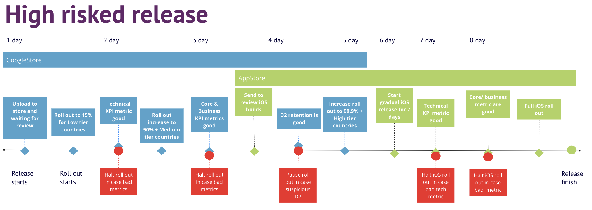
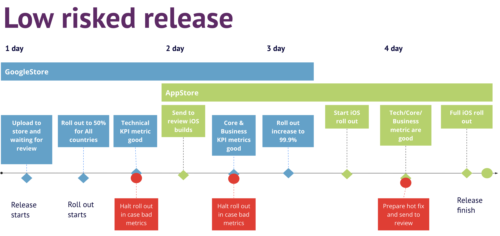

# How To Make Safer Mobile Roll out Releases

Have you had cases when you stopped your release to fix critical bug in production and release hot fixes? 
Nothing pleasant when it happens for the whole studio. This is especially crucial for business activities linked with CRM/LifeOps operations or marketing campaigns.

Apple and Google stores give you ability to make gradual releases that helps to mitigate risks with rollout of a new version.
Of course the gradual approaches a not significant different from each other but main concepts are similar.
Making the release process smooth and clear is important to give players new stuff on time with less risks.

Let's see how you could modify your roll out strategy to decrease impact of potential risks in production.

**Overview**

| App store   | Review process                                                                     | Gradual opening                                                                                                                                                          | Guidelines                                                                                                                       |
|-------------|------------------------------------------------------------------------------------|--------------------------------------------------------------------------------------------------------------------------------------------------------------------------|----------------------------------------------------------------------------------------------------------------------------------|
| Google      | [Link](https://developers.google.com/workspace/marketplace/about-app-review)       | [yes](https://support.google.com/googleplay/android-developer/answer/6346149?visit_id=638228478821573509-2375162816&rd=1#zippy=) - target direct percent and countries   | [Release](https://play.google.com/console/about/guides/releasewithconfidence/), [Quality](https://developer.android.com/quality) |
| Apple store | [Link](https://developer.apple.com/app-store/review/)                              | [yes](https://developer.apple.com/help/app-store-connect/update-your-app/release-a-version-update-in-phases)  - for 7 days , not direct percent  and no target countries | [App Store Review Guidelines](https://developer.apple.com/app-store/review/guidelines/)                                          |

>Gradual release is Phased release for AppStore and Stage release for Google

>I recommend to read [Google Staged Rollouts & App Store Phased Release: With Less Stress](https://medium.com/geekculture/google-staged-rollouts-app-store-phased-release-with-less-stress-1d51dffde7a7)

**Common limitations of app stores**
- You can not exclude directly specific players like VIP from target audience when roll out a new release.
- You can have only one gradual production release at the same time with the full rollout release.
- Review process usually takes about 1 day but can be up to 7 days in exceptional cases like during holidays or fixing compliance issues.
- Technical metrics came to App stores dashboards with delays. It can be a critical time lag to mitigate impact of an issue on your audience.

**Key bullets to mitigate risks during roll out of your new release are:**
- Understanding level of risks for the new release from the development increment perspective.
- Defining tracked KPI metrics and abilities to monitor them in real time or with the lowest time latency.
- Choose right strategy for new release roll out depended on risks.
- Have a plan B in case of critical issues in production.
- Have a calendar for some time ahead to plan everything accordingly to app store holidays of avoid collisions with CRM/LiveOPS activities.

# How risky is your release?
That is really crucial to determine is **high risked** release or **less risked** release. Understanding of risks for a new release will help
to choose the best strategy for gradual opening with risks mitigations. 
Any changes in the build without remote configuring options will increase the risks. Due the logic when yuo update engine core for example
that can not be disabled by remote or segment it will add risks and one way to fix unexpected bugs in production it will be release a hot fix and hope for fast users update.
Or you are not able to test the change on all target devices with full OS combinations
In this case only production test will give you understanding about stability of the release.

The hot fix will take time to develop a fix, to build new clients, to verify from QA and next to send for app store review.
The store review can be up to few days and finally you have to push users to update the game. Usually forcing users to update the game will increase uninstall ratio.
But most importantly, valuable time is wasted and low engagement users may leave the application.

In opposite logic of defining high risks in a release,
**Less risked** will be when you can operate remotely new changes or some new content can be segmented or controlled dynamically and disable any unstable part of application 
if there happens any unexpected issues.

# Do you have defined **tracked KPI's of release** ?
Next when you are able to identify level of your risks for a new release you need somehow understand that everything is okay in production.
That is important to know about users satisfaction by technical quality, not angry because new bugs and there is zero unexpected critical issues. 
Way to track comments and feedbacks on appstores or Reddit usually is to late and marketing budged might be almost fired when you understand about something goes wrong.
The key is here to choose right analytic metrics depending on strategy of your product.
And you have built the real time monitoring or at least define third party instruments that will give answer the lowest latency about matching business and technical metrics with your base lines.

I believe defining your **tracked KPI's of release** and have clear source to track them and compare them with the previous release is the second important bullet.

# Choosing the right strategy for roll out to decrease or fully avoid an impact of risky changes on your most valuable target audience 
Depends on discovered level of risks for the new release the roll out can be more or less aggressive in sense of target audience %.
If the release has high risks you have to be slower with increasing of target audience % to have more time for discovering issues and reaction on them. 
It should not be an issue if you have a calendar of changes for production.

Next ideally you have to define some segments of your audience by values came from your product. Lest assume you segment your audience per countries of users.
Usually that is correlated  good enough with generating revenue. Some countries will generate more revenue and will have more engagement of users than other.
This is regulated by store and you do not need to have third party instruments for doing that.
Usually it is enough to have 3 segments:
- Low tier countries.
- Medium tier countries.
- High tier countries + the remaining world

The main reason to define low tier countries are to collect enough technical metrics to be sure that changes are safer and you continue
rollout on other countries.

How to choose Low tier countries:
- No big revenue impaction
- Enough installs with reasonable adoption speed. If It is provide 100 installs for 1 week it is too slow and not enough data to make any decision.
- Good variety of available devices with different models and different operation system. I could remember few cases when on some regions you get analytics and issues that is not correlated with other part of world like most devices in Nepal are Vivo

To be more concrete lest use the [Top Countries/Markets by Game Revenues](https://newzoo.com/resources/rankings/top-10-countries-by-game-revenues) and define
- Low tier countries - Nepal, Thailand, Egypt, South Africa, Poland, Slovenia, Argentina.
- Medium tier countries - Germany, UK, France, Canada.
- High tier countries - USA + the remaining world.

Next define some tracked KPI metrics and potential third parties to track it:

| Metric                                                               | Group     | Platform depended | Potencial Third Party to track                                                      | Motivation                                                                                                                                                                                                                                                                                                 |
|----------------------------------------------------------------------|-----------|-------------------|-------------------------------------------------------------------------------------|------------------------------------------------------------------------------------------------------------------------------------------------------------------------------------------------------------------------------------------------------------------------------------------------------------|
| ANR/Crashes                                                          | Tech      | High              | Firebase/Google Dashboard                                                           | That is really bad signs high levels of Crashes/ANR lets imagine you paid for install but user can be crashed during the first loading flow.  Also market might decrease discoverability  of the applications with high ratio of errors.                                                               |
| Unhandled errors or errors in general                                | Tech      | Low               | Firebase                                                                            | Fairly often this type of error can indicate issues with core gameplay flows.                                                                                                                                                                                                                              |
| Loading time for the lobby                                           | Core      | High              | Unity Analytics/Firebase                                                            | If loading time increased significantly it can have serious impact on other metrics .                                                                                                                                                                                                                      |
| Time of the first game action                                        | Core      | High              | Unity Analytics/Firebase                                                            | User passed the main tutorial but for some reasons did not play ? possible a lot of issues like massive line of popups or screen hanging                                                                                                                                                                   |
| Tutorial completion rate                                             | Core      | Low               | Unity Analytics/Firebase                                                            | if your new user will not able to pass main tutorial dur bags it seems you will lost user                                                                                                                                                                                                                  |
| D2 retention                                                         | Business  | High              | Firebase/Appsflyer                                                                  | Sometimes unclear and hard discovered technical issues can have impact on retention, like degradation of performance                                                                                                                                                                                       |
| Level 2-N completion rate                                            | Business  | Low               | Appsflyer                                                                           | to identify quality of a traffic it is important to be confident about key business metrics to qualify your new users                                                                                                                                                                                      |
| [Organic installs](https://www.adjust.com/glossary/organic-install/) | Business  | High              | Appsflyer                                                                           | if you do not apply changes in your ASO or did nothing about getting more organic installs but see significant changes in organic installs it can be a serious trigger to take a look on your competitors or missed updates from platforms.  Or review again referer mechanics from technical side |
> D2 retention might be optional if + 2 days for roll out is not acceptable for your strategy

> The main idea is to evaluate the health of application in production from Tech, Core, Business sides.

**Lets see 2 strategies for High risked and Low risked release.**

Based on [Sensor Tower](https://sensortower.com/blog/app-revenue-and-downloads-2021)
<em> iOS applications generated over 87 billion dollars of revenue in 2021 compared to just under 48 billion from Android.
The iOS market share might be smaller, but it is far more profitable than Android. 
</em>  

I recommend to get maximum analytics about stability from Google Android first and Next start roll out on Apple Store. 
Also from my point of view Google Developer Console give you amazing capabilities to operate releases and get vital data from your release in comparing with other App Stores. 

## Strategy A

> The time of sending iOS for review is important because in case of resending new version with fixes for again review without release the existing reviewed one it can be much slower to get next review.

> Timeline should be adjusted to your DAU and level accepting risks. From my experience it is enough 20k of DAU events in total of updates and new installs and >60k sessions to make decisions about technical stability with good level of confidence.

> Ideally you need to compare metrics per selected countries like metric A from countries B, C from major release with metric A from countries B, C from a new release. And take into account similar installs rate.

## Strategy A when you do not have custom dashboards to track KPI's in real time with flexible configurable options for comparing metrics

> The main difference is you first open the **major release** with new version to **Low tier countries** only for 2-3 days.

> This approach will provide from store perspective most comparable analytics for your new risked release.

> The biggest disadvantage is additional time up to 3 days. In the other hand it will exclude any hidden issues with not consistent gradual updates by app stores.

## Strategy B

> The main difference you start opening for all countries. Your release changes are low platform depended and it means you can make right decisions with high chances of true about the version stability based on Google metrics.

> To have reliable analytics I personally prefer to start release for all world countries, but from less percent. 

> If you do not have custom real time dashboards and configured alerts on bad metrics threshold it is better to start roll out from lower target %. That will give you more time for reaction.

> Timeline should be adjusted to your DAU and level accepting risks.

# Advices: 
## About comparing metrics:
You have to compare KPI metrics between same countries and installs of same days and volume. 
You can make wrong decisions about stability a version when you compare a metric from version with 5k of sessions with a version with 1M sessions for instance 
or to compare D2 for Nepal location with USA D2.
Ideally you should take USA organic installs for last 2 days from the newest version and compare USA organic installs for last 2 days from the previous release.

## About Google full roll out:
Make full rollout of the previous version only when you start a new release. Lets put the main target adoption of a new release to 99.9% for Google. It will allow you to halt rollout
immediately in case of unexpected troubles in production. 
Otherwise you need to resubmit of client with new app version code to be accepted by store and pass the review again. When critical bug in production happens
and you could not decrease impact of an issue immediately by a remote option it makes sense to save time as much as possible.

## About preparing the release candidate before sending it to review:
Make final smoke QA check before opening of the app on builds downloaded from stores(testflight , not distributed as a bundle or apk. Because some game functionality can be triggered only from store builds.
Like google referer api otherwise you can miss the technical issues and be frustrated in production with real players. 

## Avoid mixing technical and non technical changes in one release
I recommend to separate technical and non technical changes into different releases to avoid mixing a lot of changes for big period of development into one release.
If you will see bad results in your tracked KPI for a new release it would be definitely hard to find a root cause. Is it an issue with new reskined UI or there a technical issue with pushes that freeze devices?

## Every new release will not degrade KPI's goal
That is ambitious goal.
Accumulative effect of changes for few releases at line will make impossible to detect a right root cause of degradation some metric.
And from my experience that is easier to break something and spend to much time to compensate the metric by future fixes and changes next.

## Features to take a look
[Google Custom store listings](https://support.google.com/googleplay/android-developer/answer/9867158?visit_id=638228524369380759-314294836&rd=1)
[Custom product pages](https://developer.apple.com/app-store/custom-product-pages/)
[Unity Distribution Portal](https://unity.com/products/unity-distribution-portal)
- An estimated 1.7 billion mobile gamers will be using alternative app stores by 2023.
- Around $5 billion dollars of revenue will be generated in stores outside of China.
- Third-party app marketplaces are growing faster than the Google Play store.
- The Unity Distribution Portal already reaches 1 billion+ players connected to these stores.

# One more thing where you have to be in touch with store changes to avoid unxpected troubles during app review:
- To be compliant with the newest of app store requirements. Like support new Android API for Google or Tracking policy from Apple.
- To be compliant with App Store Quality Guidelines. Actually it is good for potential featuring and get more organic install, but you decrease a chance for declining version.
- To have options with excluding resubmit to store from your release process as much as possible. It can be asset bundle content or dynamic upload your product.

# In Conclusion

The store rollouts is the important step in the release process. 
Until your version is available on all platforms, it's still a work in progress. 
Rollout strategies help reduce risks with new changes and prevent losing your most important product audience.
A right rollout strategy also makes it easy to add new app stores like Samsung Galaxy Store, Amazon, or Huawei AppGallery.

Remember, there's no one perfect strategy to launch new release for everyone. It's a complex process that depends on many things. 
These suggestions should help you make your rollouts better or to take look differently.

I'm looking forward to hearing your thoughts in the comments.

Wishing you the best of luck with your releases!
